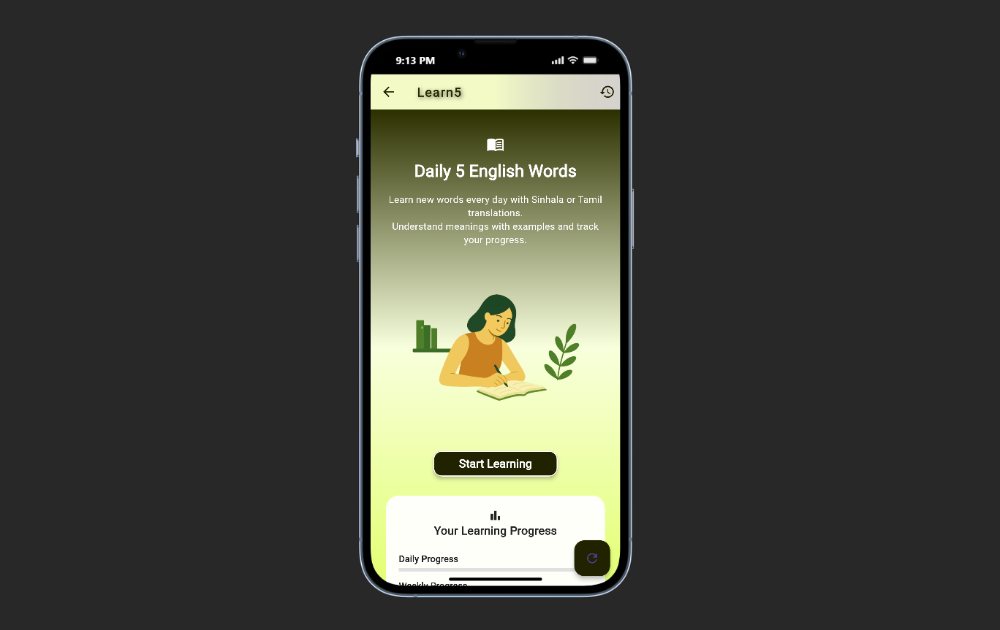
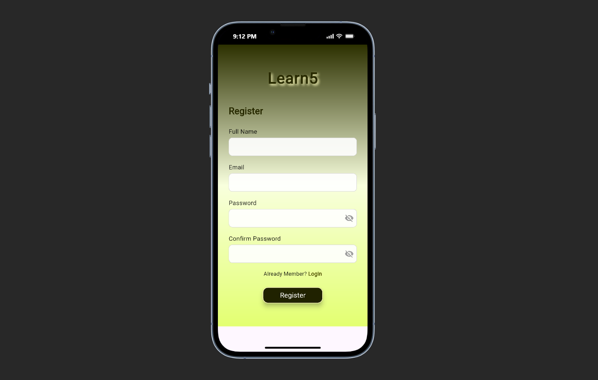
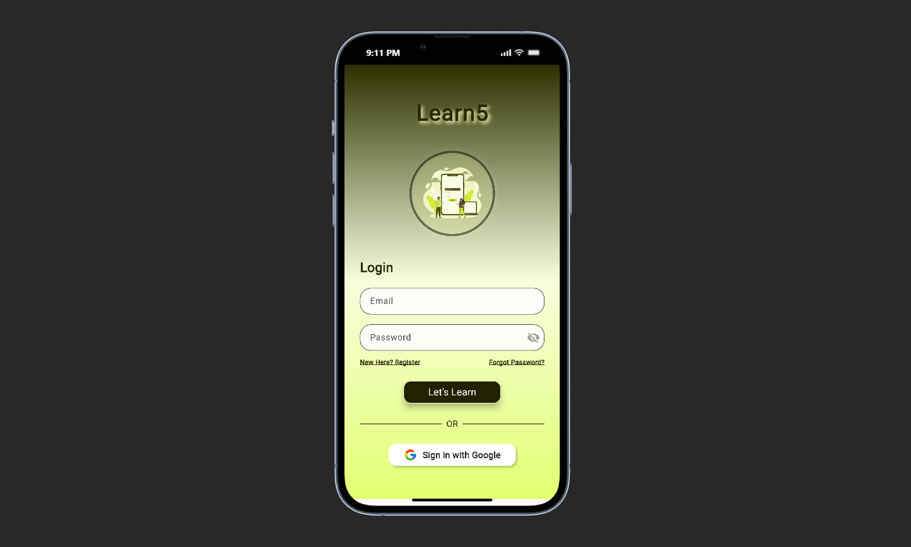

# Learn5

**Learn5** is a beginner-friendly **Flutter mobile app** designed to help users in Sri Lanka learn **5 new English words every day**.  
The app supports **Sinhala, Tamil, and English**, making daily vocabulary learning simple and fun.  

---

## 🌟 Features

- Daily 5 English words for learning  
- Sinhala and Tamil translations for better understanding  
- Example sentences for each word  
- Track your learning progress  
- Simple and user-friendly interface  

## 🛠️ Tech Stack

- **Frontend:** Flutter & Dart  
- **State Management:** Provider / setState  
- **Backend / Cloud Services:** Firebase (Authentication, Firestore)  
- **Local Storage:** SharedPreferences (save user progress locally)  
- **Fonts:** Google Fonts  
---

## 📸 Screenshots

### Welcome Screen

### Home Page

### Sign-Up Page

### Login Page

